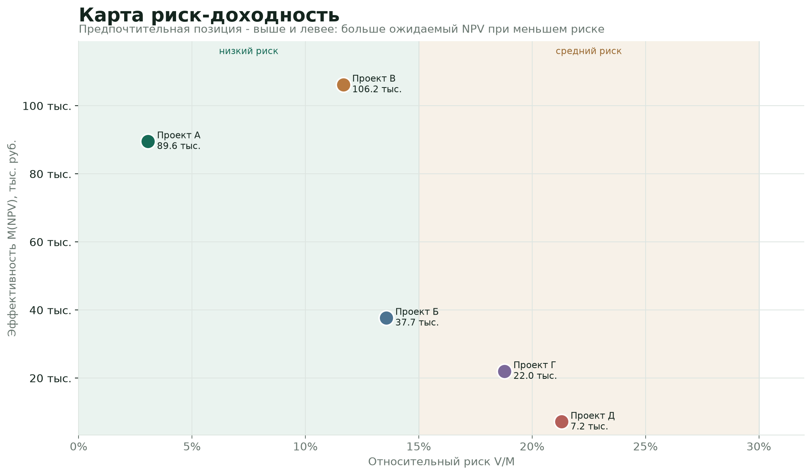
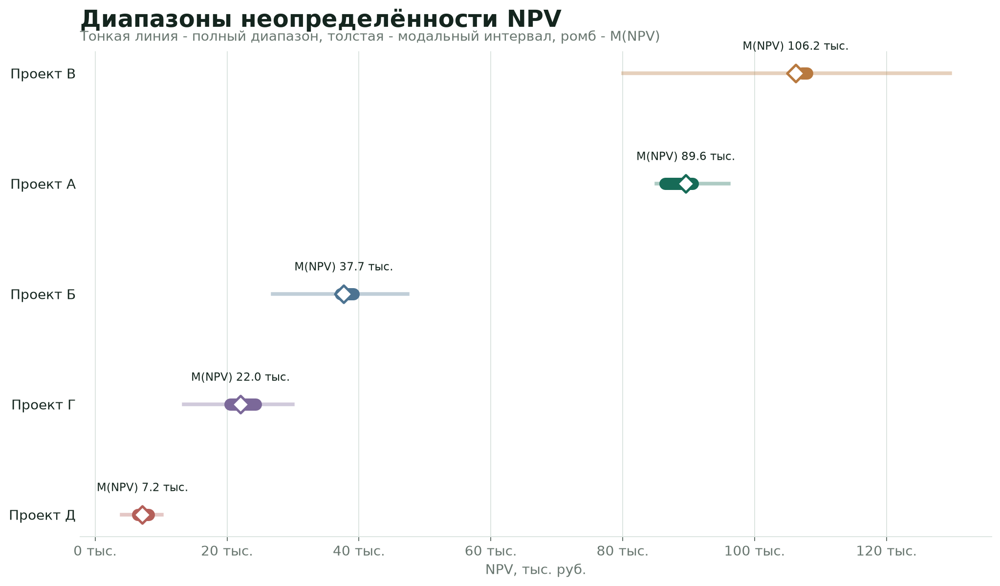
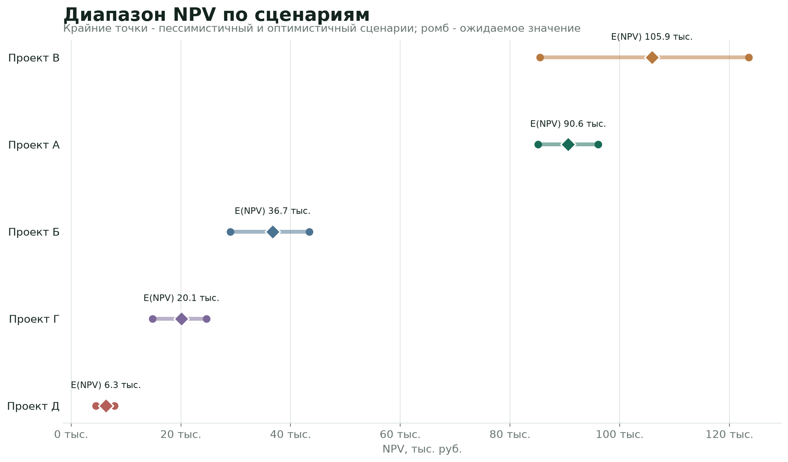

# Оценка инвестиционных проектов в условиях неопределённости


Python-модель для сравнения пяти обезличенных инвестиционных проектов четырьмя методами. Расчёты перенесены из исходной Excel-модели в проверяемые функции, дополнены автоматическими тестами, рейтингом и визуализациями.

## Что оценивает модель

| Метод | Вопрос | Основные показатели |
|---|---|---|
| Бюджетная эффективность ВК 477 | Окупается ли господдержка будущими доходами бюджета? | NPV бюджета, PI, срок окупаемости |
| Сценарный анализ | Насколько результат зависит от пессимистичного, базового и оптимистичного сценариев? | E(NPV), дисперсия, СКО, коэффициент вариации |
| Нечёткий NPV | Какова возможность неотрицательного NPV при интервальной неопределённости? | Poss(NPV >= 0) |
| Метод Чиу-Парка | Как сопоставить ожидаемую эффективность и риск? | M(NPV), V(NPV), V/M, класс риска |

## Результат сравнения

Рейтинг по M(NPV) метода Чиу-Парка:

| Ранг | Проект | M(NPV), тыс. руб. | V/M | Риск |
|---:|:---:|---:|---:|---|
| 1 | В | 106 218,02 | 0,1167 | низкий |
| 2 | А | 89 551,25 | 0,0306 | низкий |
| 3 | Б | 37 694,47 | 0,1357 | низкий |
| 4 | Г | 22 030,78 | 0,1878 | средний |
| 5 | Д | 7 166,57 | 0,2130 | средний |

Высокий M(NPV) сам по себе не заменяет решение: рейтинг нужно читать вместе с относительным риском, бюджетной эффективностью и качеством исходных предположений.

### Сводное сравнение методов

| Проект | NPV бюджета, тыс. руб. | PI | E(NPV), тыс. руб. | Коэф. вариации | M(NPV), тыс. руб. | V/M | Риск |
|:---:|---:|---:|---:|---:|---:|---:|---|
| А | 137 002,81 | 6,72 | 90 594,00 | 0,0427 | 89 551,25 | 0,0306 | низкий |
| Б | 37 231,85 | 10,53 | 36 717,61 | 0,1394 | 37 694,47 | 0,1357 | низкий |
| В | 107 223,79 | 77,12 | 105 865,88 | 0,1276 | 106 218,02 | 0,1167 | низкий |
| Г | 20 449,36 | 3,64 | 20 097,06 | 0,1744 | 22 030,78 | 0,1878 | средний |
| Д | 6 446,00 | 2,91 | 6 323,26 | 0,1931 | 7 166,57 | 0,2130 | средний |

Для всех пяти проектов `Poss(NPV >= 0) = 1`. Машиночитаемые версии таблиц сохраняются в `results/project_comparison.csv` и `results/ranking.csv`.

## Визуализации

### Риск и доходность



### Диапазоны нечётких оценок NPV



### Диапазоны сценариев



## Быстрый запуск

Требуется Python 3.11 или новее.

```bash
python -m venv .venv
source .venv/bin/activate
pip install -r requirements-dev.txt

python validate_project_b.py
python analysis.py
python charts.py             # пересобрать графики и CSV-таблицы
pytest -q
```

`validate_project_b.py` возвращает ненулевой код завершения при расхождении с эталоном, поэтому проверку можно использовать в CI.

## Проверки входных данных

Ядро отклоняет некорректные входы до расчёта:

- массивы разных размеров и пустые наборы;
- годы не в возрастающем порядке;
- вероятности вне допустимого диапазона или с суммой не равной 1;
- нечисловые и бесконечные значения;
- точки нечёткого числа не в порядке `npv1 <= npv2 <= npv3 <= npv4`;
- недопустимые порог, ставка дисконтирования и параметр lambda.

Относительный риск рассчитывается через абсолютное ожидаемое значение, поэтому не становится отрицательным для проектов с отрицательным NPV.

## Структура

```text
investment_methods.py    вычислительное ядро четырёх методов
projects_data.py         обезличенные данные пяти проектов
analysis.py              сводная таблица и рейтинг
charts.py                генерация трёх графиков
charts/                  сохранённые изображения
results/                 сводная таблица и рейтинг в CSV
validate_project_b.py    CLI-сверка с эталонной Excel-моделью
tests/                   автоматические тесты и граничные случаи
analysis.ipynb           пошаговый разбор расчётов
```

## Корректность расчётов

Проект Б используется как эталон, потому что в исходной Excel-модели для него сохранены промежуточные показатели всех четырёх методов. Автоматический тест сверяет NPV, PI, E(NPV), СКО, Poss(NPV >= 0), M(NPV), V(NPV) и V/M.

GitHub Actions запускает тесты при каждом push и pull request.

## Источник и ограничения

Модель основана на реальных инвестиционных расчётах. Названия организаций и отраслевые признаки обезличены. В отдельных исходных Excel-листах по проекту Б встречались значения из разных версий расчёта; эталоном выбран полный обучающий лист.

Результат модели не является инвестиционной рекомендацией. Качество сравнения зависит от денежных потоков, сценарных вероятностей, ставки дисконтирования и формы нечёткого числа.

## Стек

Python, pandas, matplotlib, Jupyter, pytest.
